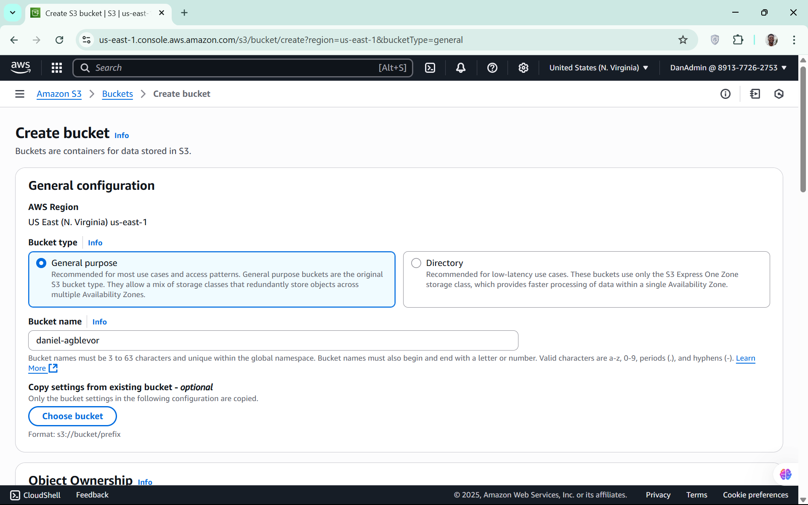
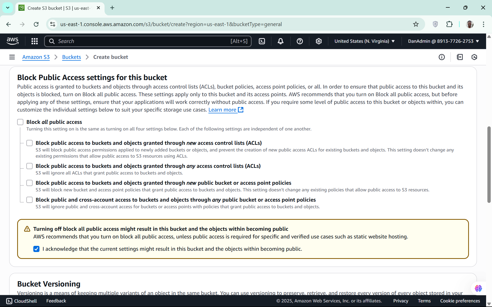
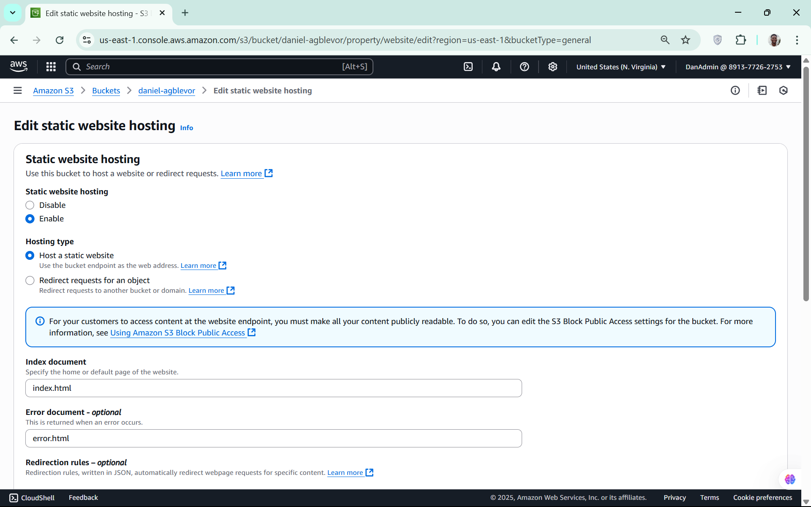
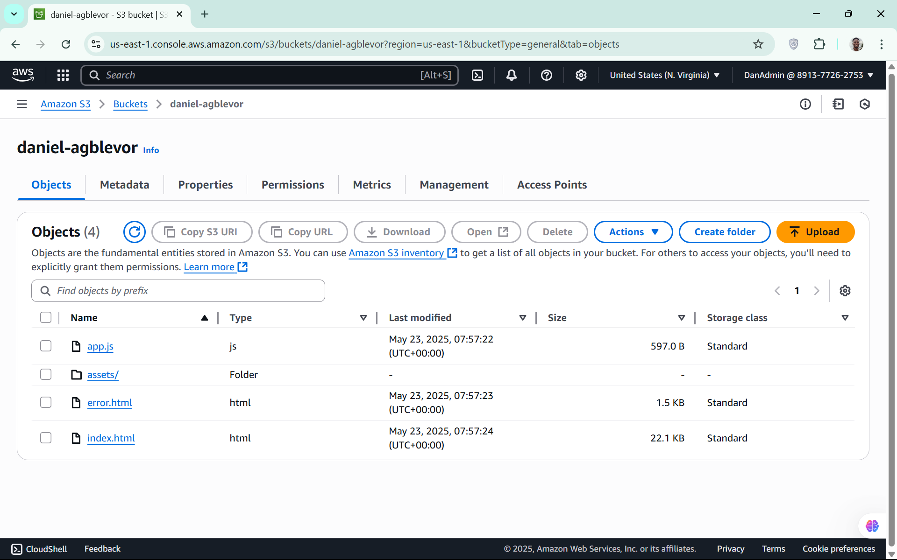
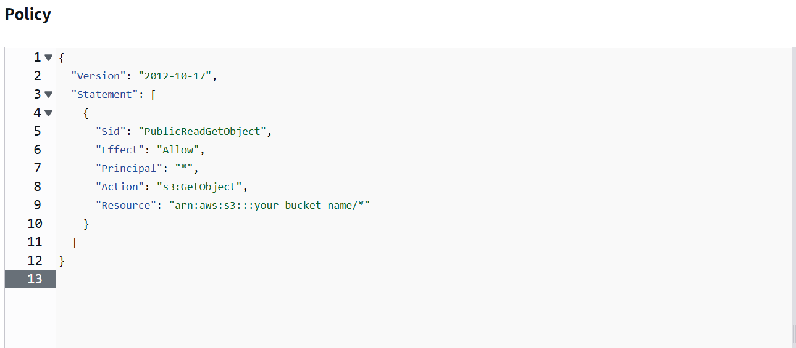
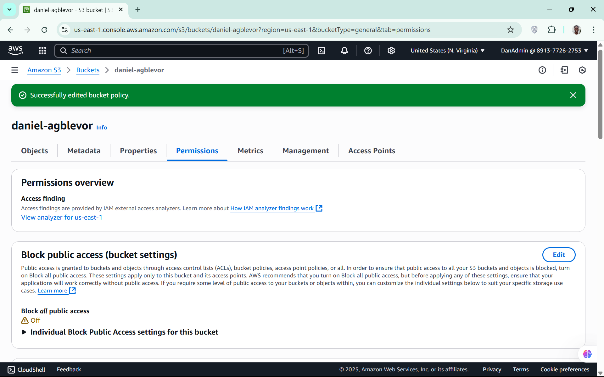
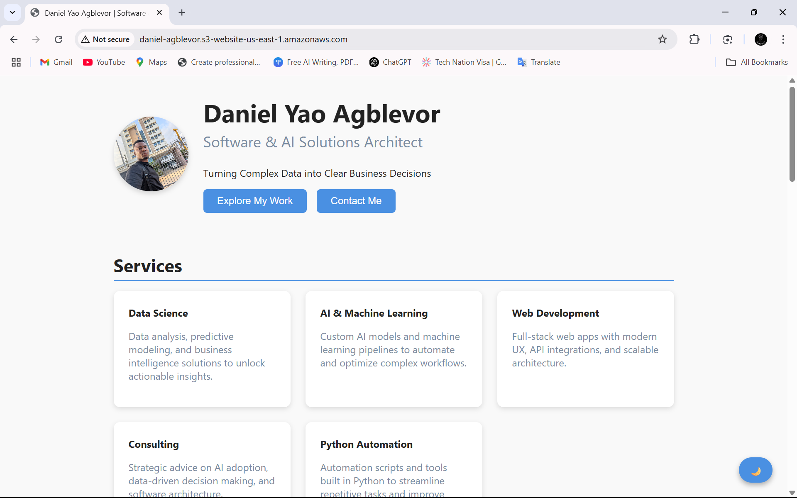
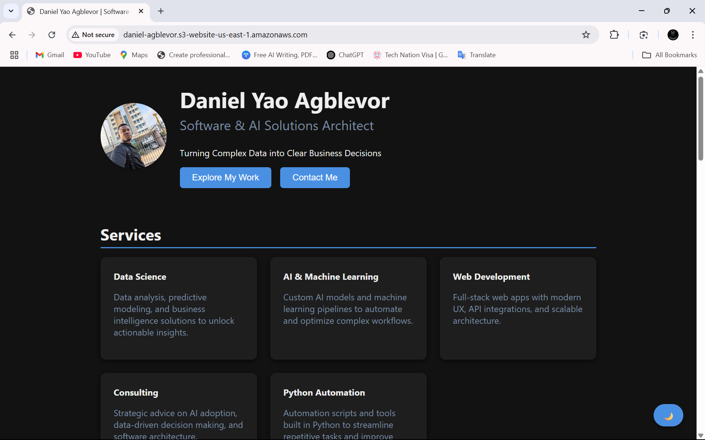

# 🌐 AWS S3 Static Website Hosting Project

This project demonstrates how to deploy a fully functional static website using **Amazon S3**, leveraging AWS cloud infrastructure for scalable and cost-effective hosting. The project showcases a complete setup, from bucket creation to access testing, along with screenshots and practical considerations for real-world deployment.

---

## 🚀 Project Overview

In this project, I have successfully:
- Created and configured an S3 bucket for static website hosting.
- Uploaded a complete static website (HTML, CSS, JavaScript, images).
- Set up public permissions to ensure accessibility.
- Validated the hosted site using both the AWS S3 endpoint and a custom domain (optional).

This repository serves as both a technical demonstration and a practical guide for stakeholders, developers, or clients interested in cloud-hosted static sites.

---

## 🛠️ Technologies Used

- **Amazon S3** – Object storage for hosting static content.
- **HTML/CSS/JavaScript** – Frontend technologies used for the website.
- **AWS IAM & Policies** – For managing public access.

---

## 📁 Project Structure

```

/website-files
│
├── index.html
├── error.html
├── app.js
└─── /assets
    ├── profile_pic.jpeg
    └── profile_pic.mp4

```

---

## 📝 Step-by-Step Implementation

### 1. ✅ Create an S3 Bucket
- Provided a globally unique bucket name [daniel-agblevor].
- Selected the region closest to the target audience for low latency.

📸 Create bucket 1


📸 Create bucket 2


📸 Create bucket 3


---

### 2. ⚙️ Configure Static Website Hosting
- Enabled **Static Website Hosting** under the bucket's Properties.
- Set `index.html` as the index document.
- Added `error.html` as the error fallback.

📸 website Hosting Settings


---

### 3. 📤 Upload Website Files
- Uploaded all necessary static files.
- Maintained a clean and logical folder structure.

📸 Uploaded Files


---

### 4. 🔐 Set Bucket Permissions
- Modified the **bucket policy** to allow public `GetObject` access.
- Ensured secure and minimal access through IAM best practices.

📄 Bucket Policy


📸 Permissions Tab


---

### 5. 🔍 Test the Website
- Accessed the website through the **AWS S3 endpoint**:
```http://daniel-agblevor.s3-website-us-east-1.amazonaws.com```

- Verified full functionality of pages, images, and scripts.

📸 website demo


📸 website screenshot - light


📸 website screenshot - dark

---

## 💡 Key Accomplishments

- Deployed a production-ready static site using cloud-native tooling.
- Demonstrated knowledge of AWS policies, permissions, and hosting.
- Ensured best practices in public access and security.
- Delivered a clean, fast, and globally accessible web experience.

---

## 📈 Future Enhancements

- Integrate the static site with a custom domain using **Route 53 DNS Management** or a third-party DNS provider like **Cloudflare**.
- Integrate with **CloudFront** for CDN support and HTTPS.
- Automate deployments with **CI/CD pipelines** (GitHub Actions or AWS CodePipeline).
- Add versioning or logging for better tracking and rollback.

---

## 📎 Supporting Files

- `bucket-policy.json` – Example of the public read policy used.
- `screenshots/` – Folder with implementation screenshots.
- `website-files/` – The actual static website content.

---

## 🤝 Contact

For questions, suggestions, or collaboration opportunities:

**Daniel Agblevor**  
📧 [mcdanagb@gmail.com]  
🔗 [LinkedIn](https://www.linkedin.com/in/daniel-agblevor/) | [Portfolio](http://daniel-agblevor.s3-website-us-east-1.amazonaws.com)